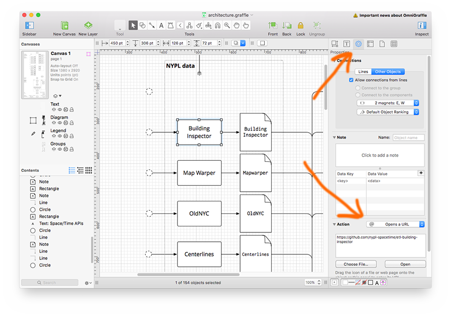

# interactive-architecture

技术总结：

* 修改github中的API 获取方式 [Repository Contents API - Contents | GitHub Developer Guide](https://developer.github.com/v3/repos/contents/) 
* 修改re `href.match(/github\.com\/(.*)\/(.*)\/?(\/\w*\/master)\/(.*)/)`
  * 新增path = match[4]  到 org & repo 出现过的地方
  * 修改 `fixRelativeLinks` 中的  var baseUrl 
  * 修改  var apiUrl 
* 清空cache, 保证新图表的正常运行 
  * Console  中查看 localStorage进行检验

* 资源：D3学习  http://using-d3js.com/ D3 API turorial
  * Bug： [ReferenceError: fetch is not defined #19](https://github.com/d3/d3-fetch/issues/19) 

- [ ] 如何添加自动清空cache机制

Interactive architecture diagrams for JavaScript.

## Examples

- Example:
  - interactive diagram: [spacetime.nypl.org/interactive-architecture/example](http://spacetime.nypl.org/interactive-architecture/example)
  - source code: [`example/index.html`](example/index.html)
  - SVG: [`example/example.svg`](example/example.svg)
- NYC Space/Time Directory architecture:
  - interactive diagram: [spacetime.nypl.org/architecture](http://spacetime.nypl.org/architecture)
  - source code: [github.com/nypl-spacetime/architecture](github.com/nypl-spacetime/architecture)
  - SVG: [`architecture.svg`](https://github.com/nypl-spacetime/architecture/blob/gh-pages/architecture.svg)

## Usage

Add the following JavaScript and CSS to your HTML:

```html
<head>
  <script src="http://spacetime.nypl.org/interactive-architecture/js/d3.v4.min.js" charset="utf-8"></script>
  <script src="http://spacetime.nypl.org/interactive-architecture/js/interactive-architecture.js" charset="utf-8"></script>
  <link rel="stylesheet" href="http://spacetime.nypl.org/interactive-architecture/css/interactive-architecture.css">
  <link rel="stylesheet" href="http://spacetime.nypl.org/interactive-architecture/css/markdown-popup.css">
</head>
```

Note: interactive-architecture needs [D3.js](https://d3js.org/) to work. You can use the version included in this repository, use a CDN, or use a local copy.

Then, add a container for the diagram:

```html
<body>
  <article>
    <div id='architecture'>
    </div>
  <article>
</body>
```

Finally, create the interactive architecture diagram using JavaScript:

```js
var config = {
  getHref: function (link) {
    return link.getAttribute('xl:href')
  },
  getStyle: function (href, link) {
    return {
      fill: 'rgba(255, 255, 255, 0)',
      strokeWidth: '2px'
    }
  },
  getPopupContents: function (href, link) {
    if (href.indexOf('https://github.com') >= 0) {
      return iA.gitHub.getReadme(href)
    }
  }
}

iA.architecture.create('#architecture', 'architecture.svg', config)
```

## Creating SVG diagrams

It's easy! Download and install [Omnigraffle](https://www.omnigroup.com/omnigraffle), create your architecture diagram and add links to each component's GitHub repository:

1. Go to the properties pane of an object;
2. Add an _Opens an URL_ action;
3. Add the HTTPS URL of the component's GitHub repository (or any other URL)



Or, if you don't want to use Omnigraffle, that's fine too! Just make sure architecture components
are contained by an `<a>` element with an `xl:href` attribute, like so:

```html
<a xl:href="https://github.com/nypl-spacetime/architecture">
  <path d="M 451 774 L 448 777 C 448 775.34315 449.34315 774 451 774 Z" />
  <text>
    <tspan>Architecture Diagram</tspan>
  </text>
</a>
```

If your SVG files use different namespaces for the `href` attributes (e.g. `xlink:href`), you can override the default namespace. See below for details.

## API

### `iA.architecture.create(element, svg, [config], [callback])`

Creates an interactive diagram from a SVG URL.

#### Parameters:

- `element`: query selector of element that will hold the diagram
- `svg`: URL of SVG file
- `config` (optional): configuration object
- `callback` (optional): function that is called when SVG is loaded and diagram is successfully created

#### Configuration:

```js
var config = {
  // SVG elements which contain the architecture diagram's components
  //   e.g. ellipse, rect, circle. Default is path.
  element: 'path',

  // Returns the attribute containing the component's URL. The link parameter
  //   is one of the diagram's SVG <a> elements.
  getHref: function (link) {
    // Example:
    return link.getAttribute('xlink:href')
  },

  // This function is called when a user clicks one the the diagram's
  //   components. The HTML returned by this function is displayed in a
  //   popup window. The return value can be a string, HTML, or a Promise
  //   returning HTML.
  getPopupContents: function (href, link) {
    // Example 1:
    return iA.gitHub.getReadme(href)

    // Example 2:
    return '💾💾 Popup contents! 💾💾'
  }
}
```

Configuration is optional; unspecified options are replaced by default options.

#### Styling:

interactive-architecture adds `interactive-architecture` class to the diagram's container element, you can use CSS to style components with links like this:

```css
.interactive-architecture a > path {
  stroke: #ef5526;
  stroke-width: 4px;
  fill: white;
}
```

Sometimes, it might be necessary to use CSS' `!imporant` rule:

```css
.interactive-architecture a > path {
  fill: red !important;
}
```

### `iA.gitHub.getReadme(org, [repo])`

Returns a Promise that will load the README.md file from the specified GitHub repository.

#### Parameters:

- `org`: GitHub username or organization of the README's repository
- `repo` (optional): name of the README's repository (if not specified, `getReadme` will assume the first parameter is a comlete repository URL)

```
iA.gitHub.getReadme("jinsanity07git", "uKnow")


iA.cache.getItem('https://api.github.com/repos/jinsanity07git/uKnow/readme')

d3.html('https://api.github.com/repos/jinsanity07git/uKnow/readme')
//d3 to decompe the apiURL

d3.html('https://api.github.com/repos/jinsanity07git/uKnow/readme').header('Accept', 'application/vnd.github.VERSION.html')
```

[Repository Contents API - Contents | GitHub Developer Guide](https://developer.github.com/v3/repos/contents/) 

```
GET /repos/:owner/:repo/readme
	api.github.com/repos/   jinsanity07git /uKnow  /readme
	
	api.github.com/repos/jinsanity07git/uKnow/contents/readme
	
Get contents
GET /repos/:owner/:repo/ contents /:path

api.github.com/repos/jinsanity07git/uKnow/contents/uLander/Readme.txt
api.github.com/repos/jinsanity07git/uKnow/contents/装备介绍/仿真器/仿真器组件介绍.md
```

hrefToOrgRepo

```
https://github.com/jinsanity07git/uKnow/blob/master/interactive-architecture-master/README.md

https://github.com/jinsanity07git/uKnow
```


```javascript
<script> 

	// initializing function to demonstrate match() 
	// method with "g" para 
	function matchString() { 
		var string = "https://github.com/jinsanity07git/uKnow/blob/master/interactive-architecture-master/README.md"; 
		var result = string.match(/github\.com\/(.*)\/(.*)\/?(\/blob\/master)\/(.*)/); 
		document.write("Output : " + result); 
	} 
    
    
    matchString(); 
	
</script>					 


Output : github.com/jinsanity07git/uKnow/blob/master/interactive-architecture-master/README.md,
  jinsanity07git,
  uKnow,
  /blob/master,
  interactive-architecture-master/README.md
```


Console

```
iA.gitHub.getReadme("https://github.com/jinsanity07git/uKnow/blob/master/interactive-architecture-master/README.md") 
```


## License

MIT
