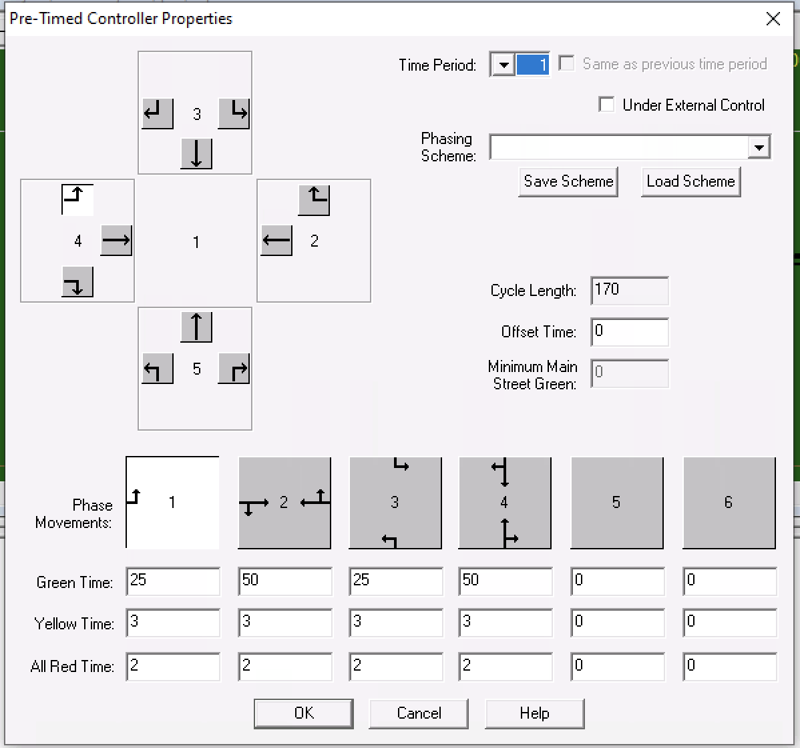
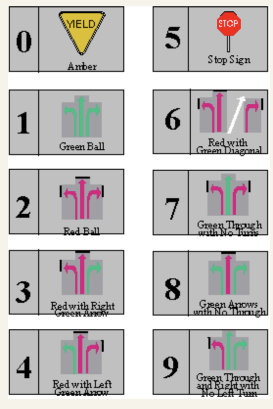

```
   1   0   4   5   2   3      25   3   2  50   3   2  25   3   2  50   3   2  35
   2       18002                                                              35
   3       18003                                                              35
   4       18004                                                              35
   5       18005                                                              35
   1 4222 0222 2222 9212 0202 2222 2424 2020 2222 2929 2020 2222              36
   2 11                                                                       36
   3 11                                                                       36
   4 11                                                                       36
   5 11                                                                       36
```

 

