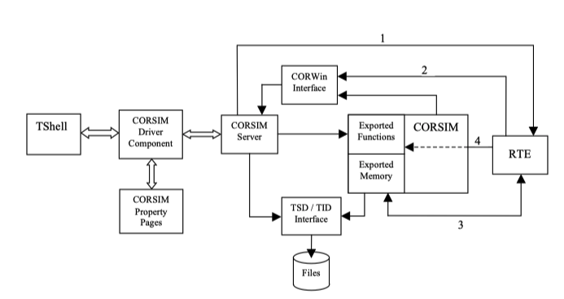
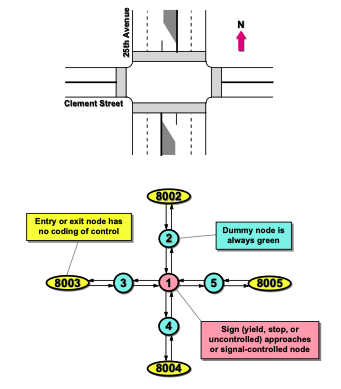

## 导语

TSIS一款由美国联邦交通局(FHWA)资助开发的一款有这40余年历史的微观交通仿真软件，并在美国多个州都有长达十余年的实际应用，也是交通微仿历史上第一个拥有GUI界面的仿真软件，目前最新的一代版本是与2012年八月发布的TSIS 6.3。新手小白通常更习惯，但是熟练之后可以通过脚本语言和二次开发，帮助用户提高定制仿真的效率，本文会对其仿真引擎CORSIM所需的输入文件做一个简单介绍，在最后会有一小段Python代码帮新手快速敲开定制开发的大门。


## TSIS软件简介

尽管这一款“年纪略大”的软件在接口设计，路网编辑，动画显示功能上与于同类型的微仿软件包括如Vissim, Transmodeler相比显得有些落后。但是其软件架构也并非铁板一块，根据官方网站上的介绍[^1]， TSIS是能够支持用户的进行交通运营分析的集成开发环境，一个在Windows系统下的集成了多种组件的工具箱。在这款工具箱中，你能够进行路网建模，修改交通仿真分析的输入文件，运行交通仿真模型，以及解析模型的输出文件。你能在TSIS中使用的各个组件都有：

* `TShell` : TSIS的GUI界面，用于管理项目文件和功能接口
* `CORSIM `:  微观交通仿真引擎，支持C++和Fortran的接口开发，读取`trf`文件
* `TRAFED`:  交通路网编辑器，关联文件格式为`tno`, 并能在路网编辑完成后转生成`trf`文件
*  `TRAFVU`:  仿真结果动画查看工具
* `TSIS Text Editor` : `trf`文本编辑器，根据动态的文本提示直接修改输入文件中的属性，适用于有经验的员工
* `TSIS Script Tool` : 一款能运行Visual Basic脚本的工具拓展，内含CORSIM 服务器接口和TRF修改器接口
* `TSIS Translator` ： 一项能将`trf`文件转换成 `tno`(TRAFED native format) 文件格式的功能

简单来说，TSIS 中集成了一系列解析输入输出文件的功能来能方便的使用交通仿真引擎。但是如果你有一定的开发能力，就可以尝试可以针对里面的输入输出文件进行进一步的开发。

当然官方文档里的开发指南是这么一个架构：



乍一看还挺唬人的，也要求开发者有一定的C++和Fortran语言基础。那么如果不会C++难道就不能快速定制仿真分析了吗？

可别忘了上文提及到`TSIS Script Tool`， 支持用脚本语言对输入文件进行批量操作，虽然Tshell中还只保留了Visual Basic的选项。但是只要你知道如何修改TRF文件的原理之后就能快速上手，批量定制的仿真输入文件的过程，并且可以由更易上手的python语言来帮助你实现。不过在正式进入示例代码之前，还要先花一些时间熟悉一下trf文件的编码方式和对应内容。

## 路网格式

首先我们需要一个信息完整的基础路网，如下图所示，红色部分代表高速路网，蓝色圈内则是地面路网，整个路网的基础拓扑结构有点和线组成，当然节点有三种类型分别是8开头的外部流量节点，7开头的辅助节点，以及2开头的内部流量节点。


最简单的交叉口模型可以用下图结构来展示：



路网一旦搭建完成就会生成如下内容的TRF文件，用文本编辑器打开即可：

```
-
```

其中最右边数字，也就是从左往右数第78-80的字符段，表示的是不同类型的记录。这一种记录在CORSIM中一共有85条，数字从1开始最大可至210，其中包含一部必须的记录当然也有一部分可选的记录。有兴趣的小伙伴可以从官方文档” CORSIM Reference Manual“中了解更多和记录类型相关的信息。

举个具体到例子，对于上述文本的例子来说，`记录11`表示的是路面路段，因此在每一行对应`11`的字符串中会有相对应的字符起始位置对应路面路段所需包含的信息。就像下表展示的这样，1-4字符对应的是上游节点，2-5字符对应的是下游节点，如果我们需要根据需求快速修改路段的车道数目，只需要在第6条所对应的22位上修改相应的数字即可，当然在trf格式限制下这个数必须是1-7之间的整数。同理，其他记录的操作方式也能以此类推。

| **ENTRY** | **STR COL** | **END COL** | **NAME**                                                     | **TYPE** | **RANGE**                  | **UNITS**         | **DEFAULT** |
| --------- | ----------- | ----------- | ------------------------------------------------------------ | -------- | -------------------------- | ----------------- | ----------- |
| 1         | 1           | 4           | Link's upstream node number                                  | Integer  | 1-6999,7000-7999,8000-8999 | Node ID           | None        |
| 2         | 5           | 8           | Link's downstream node number                                | Integer  | 1-6999,7000-7999,8000-8999 | Node ID           | None        |
| 3         | 9           | 12          | Length of link                                               | Integer  | 0,50-9999                  | Feet              | None        |
| 4         | 13          | 16          | Length of left-turn pocket                                   | Integer  | 0,20-1000                  | Feet              | 0           |
| 5         | 17          | 20          | Length of right-turn pocket                                  | Integer  | 0,20-1000                  | Feet              | 0           |
| 6         | 22          | 22          | Number of lanes                                              | Integer  | 1-7                        | Number of Lanes   | None        |
| 7         | 24          | 24          | Number of lanes in left-turn pocket                          | Integer  | 0-2                        | Number of Lanes   | 0           |
| 8         | 26          | 26          | Number of lanes in right-turn pocket                         | Integer  | 0-2                        | Number of Lanes   | 0           |
| 9         | 27          | 28          | Grade                                                        | Integer  | -9-9                       | Percentage        | 0           |
| 10        | 29          | 29          | Distribution Code. Queue discharge and start-up lost time characteristics. | Integer  | 1-4                        | Not Applicable    | 1           |
| 11        | 30          | 30          | Channelization code for lane 1                               | Text     | 0-9,D,T                    | Not Applicable    | 0           |
| 12        | 31          | 31          | Channelization code for lane 2                               | Text     | 0-9,D,T                    | Not Applicable    | 0           |
| 13        | 32          | 32          | Channelization code for lane 3                               | Text     | 0-9,D,T                    | Not Applicable    | 0           |
| 14        | 33          | 33          | Channelization code for lane 4                               | Text     | 0-9,D,T                    | Not Applicable    | 0           |
| 15        | 34          | 34          | Channelization code for lane 5                               | Text     | 0-9,D,T                    | Not Applicable    | 0           |
| 16        | 35          | 35          | Channelization code for lane 6                               | Text     | 0-9,D,T                    | Not Applicable    | 0           |
| 17        | 36          | 36          | Channelization code for lane 7                               | Text     | 0-9,D,T                    | Not Applicable    | 0           |
| 18        | 37          | 40          | Downstream node receiving left-turning traffic               | Integer  | 1-6999,7000-7999,8000-8999 | Node ID           | None        |
| 19        | 41          | 44          | Downstream node receiving through traffic                    | Integer  | 1-6999,7000-7999,8000-8999 | Node ID           | None        |
| 20        | 45          | 48          | Downstream node receiving right-turning traffic              | Integer  | 1-6999,7000-7999,8000-8999 | Node ID           | None        |
| 21        | 49          | 52          | Downstream node receiving diagonal traffic                   | Integer  | 1-6999,7000-7999,8000-8999 | Node ID           | None        |
| 22        | 53          | 56          | Upstream node for traffic opposing left-turning traffic      | Integer  | 1-6999,7000-7999,8000-8999 | Node ID           | None        |
| 23        | 57          | 60          | Mean value of start-up lost time                             | Integer  | 0-99                       | Tenths of Seconds | 20          |
| 24        | 61          | 64          | Mean queue discharge headway                                 | Integer  | 14-99                      | Tenths of Seconds | 18          |
| 25        | 65          | 68          | Desired free-flow speed                                      | Integer  | 0,10-65                    | Miles Per Hour    | 30          |
| 26        | 70          | 70          | Right turn on red code                                       | Integer  | 0-1                        | Not Applicable    | 0           |
| 27        | 71          | 71          | Pedestrian code                                              | Integer  | 0-3                        | Not Applicable    | 0           |
| 28        | 72          | 72          | Through lane number that aligns with lane on downstream link | Integer  | 1-7                        | Lane ID           | 1           |
| 29        | 73          | 73          | Through lane number that aligns with lane on upstream link   | Integer  | 1-7                        | Lane ID           | 1           |
| 30        | 79          | 80          | Record Type                                                  | Integer  | 11                         | Not Applicable    | None        |


## 代码实践

说了那么多，不如就哪一个简单的代码来上手试试：

* 首先需要将上述的trf内容保存为trf文件,用文本编辑器打开，将后缀改为TRF即可。如保存为：intersection.trf
* 接下来，可以尝试定义输入文件名称，new.trf
* 这个例子里我阐释在路段【1，5】所对应的记录11中，将原先的车道数从2条改成3条，所以在if条件语句不变的情况下，修改变量num_lane即可
* 最后点击运行，就会在同目录下看到修改后的trf文件了

```python
# 指定修改后的文件名
out = open("new.trf","w")
# 编辑所需要车道数目
num_lane = 3
# 原始文件位置
with open("intersection.trf", "r") as file:
  trf = file.readlines()
  for line in trf:
    # 自定义定位条件：上游节点，下有节点，记录类型
    if line[0:4] == '   1' and line[4:8] == '   5' and line[77:80] ==' 11':
      newline = line[0:21] + str(num_lane) + line[22:80] +'\n'
      out.write(newline)
    else:
      out.write(line)
out.close()
```

至此，有关CORSIM输入文件的初步认识和上手教程就差不多了，感兴趣的小伙伴可以尝试玩一玩这个代码（紧紧需要简单的逻辑判断和字符串拼接技术），就可以在未来应对更个性化的需求。

后面会跟大家介绍更多有关corsim引擎的玩法，欢迎更多感兴趣的同学与作者进行进一步的交流！

 

## 参考文献

[^1]: https://mctrans.ce.ufl.edu/mct/index.php/tsis-corsim/ 
[^2]:  CORSIM User's Guide Version 6.0 
[^3]:   CORSIM Run-Time Extension (RTE) Developer's Guide
[^4]:   CORSIM Reference Manual


