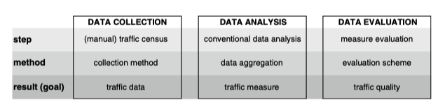
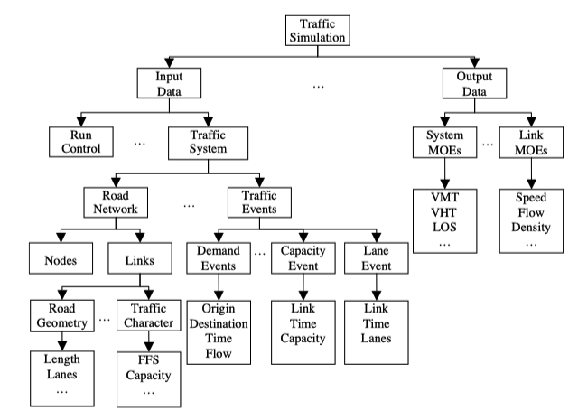

[CORSIM User's Guide](/Users/jinsanity/Zotero/storage/EYEFN9RP/CORSIMUsersGuide.pdf)

2.2.13

Fuel consumption and pollutant emissions

Detailed vehicle characteristics for fuel consumption and pollutant emissions can be specified. NETSIM and FRESIM now use the same tables for fuel consumption and emissions. Record Type 172 is used to specify the data tables for both NETSIM and FRESIM. The fuel consumption rates can be specified for autos, trucks, and buses. Only one rate of HC emissions, CO emissions, and NOx emissions can be set for all types of vehicles.

High Hydrocarbon (**HC**) **emissions** 

Carbon Monoxide Emissions

 Nitrogen Oxides (NOx) emissions

Fig. 9.1 Traditional approach: Process steps for the determination of traffic quality (@ Barceló and Kuwahara 2010)

Organizing traffic simulation data (FFS  free flow speed). (Ni and Leonard 2004)

